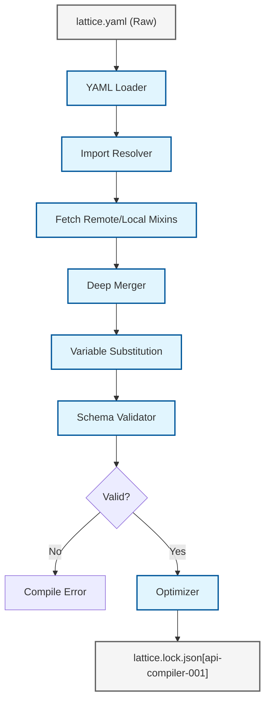

# Compiler Logic

```mermaid
flowchart TD
    classDef file fill:#f5f5f5,stroke:#616161,stroke-width:2px;
    classDef core fill:#e1f5fe,stroke:#01579b,stroke-width:2px;

    Raw["lattice.yaml (Raw)"]:::file --> Loader[YAML Loader]:::core
    
    Loader --> Resolver[Import Resolver]:::core
    Resolver --> Fetch[Fetch Remote/Local Mixins]:::core
    
    Fetch --> Merger[Deep Merger]:::core
    Merger --> Vars[Variable Substitution]:::core
    
    Vars --> Validator[Schema Validator]:::core
    
    Validator --> Valid{Valid?}
    Valid -- No --> Error[Compile Error]:::error
    Valid -- Yes --> Optim[Optimizer]:::core
    
    Optim --> Compiled["lattice.lock.json[api-compiler-001]"]:::file
```
