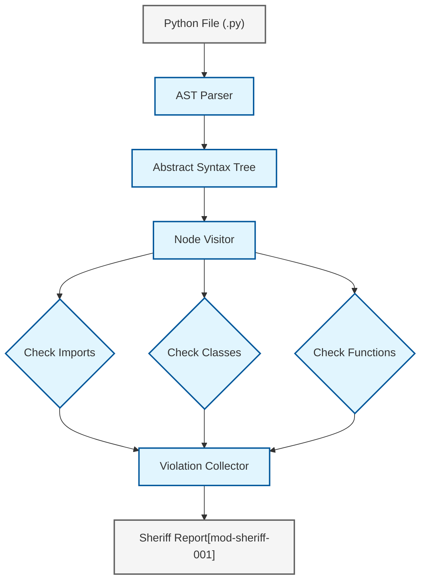

# Sheriff AST Analysis

```mermaid
flowchart TD
    %% Classes
    classDef file fill:#f5f5f5,stroke:#616161,stroke-width:2px;
    classDef core fill:#e1f5fe,stroke:#01579b,stroke-width:2px;
    
    SourceFile["Python File (.py)"]:::file --> Parser[AST Parser]:::core
    
    Parser --> AST[Abstract Syntax Tree]:::core
    
    AST --> Visitor[Node Visitor]:::core
    
    Visitor --> CheckImp{Check Imports}:::core
    Visitor --> CheckClass{Check Classes}:::core
    Visitor --> CheckFunc{Check Functions}:::core
    
    CheckImp --> Collector[Violation Collector]:::core
    CheckClass --> Collector
    CheckFunc --> Collector
    
    Collector --> Report["Sheriff Report[mod-sheriff-001]"]:::file
```
