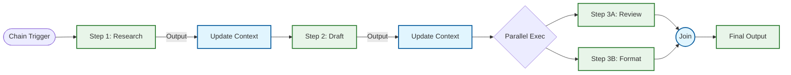

# Chain Execution Flow

```mermaid
flowchart LR
    classDef core fill:#e1f5fe,stroke:#01579b,stroke-width:2px;
    classDef process fill:#e8f5e9,stroke:#2e7d32,stroke-width:2px;

    Start([Chain Trigger]) --> Step1[Step 1: Research]:::process
    
    Step1 --> |Output| Context1[Update Context]:::core
    
    Context1 --> Step2[Step 2: Draft]:::process
    
    Step2 --> |Output| Context2[Update Context]:::core
    
    Context2 --> Parallel{Parallel Exec}
    
    Parallel --> Step3A[Step 3A: Review]:::process
    Parallel --> Step3B[Step 3B: Format]:::process
    
    Step3A & Step3B --> Join((Join)):::core
    
    Join --> Final[Final Output]:::process
```
