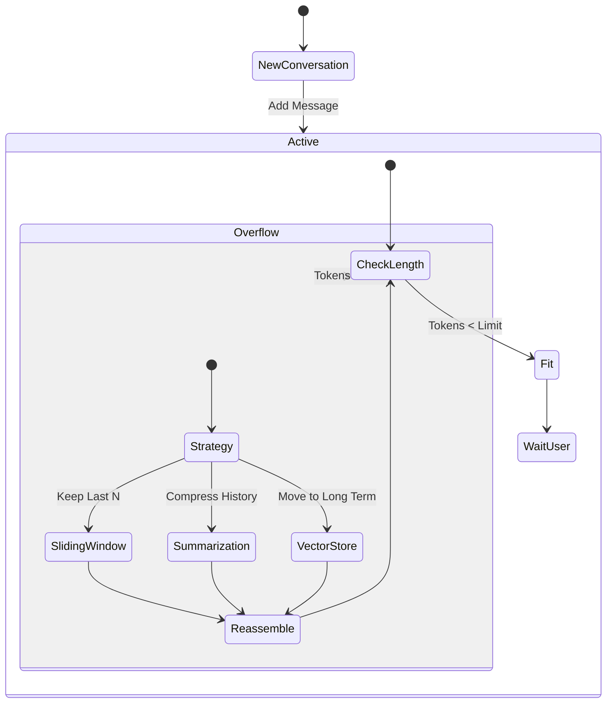

# Context Window Management

```mermaid
stateDiagram-v2
    [*] --> NewConversation
    
    NewConversation --> Active: Add Message
    
    state Active {
        [*] --> CheckLength
        CheckLength --> Fit: Tokens < Limit
        CheckLength --> Overflow: Tokens > Limit
        
        Fit --> WaitUser
        
        state Overflow {
            [*] --> Strategy
            Strategy --> SlidingWindow: Keep Last N
            Strategy --> Summarization: Compress History
            Strategy --> VectorStore: Move to Long Term
            
            SlidingWindow --> Reassemble
            Summarization --> Reassemble
            VectorStore --> Reassemble
            
            Reassemble --> CheckLength
        }
    }
```
