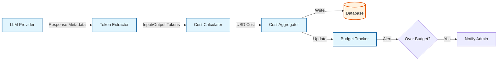

# Cost Tracking Data Flow

```mermaid
flowchart LR
    %% Classes
    classDef source fill:#e1f5fe,stroke:#01579b,stroke-width:2px;
    classDef storage fill:#fff3e0,stroke:#e65100,stroke-width:2px;
    
    Provider[LLM Provider]:::source --> |Response Metadata| Extractor[Token Extractor]:::source
    
    Extractor --> |Input/Output Tokens| Calculator[Cost Calculator]:::source
    
    Calculator --> |USD Cost| Aggregator[Cost Aggregator]:::source
    
    Aggregator --> |Write| DB[(Database)]:::storage
    Aggregator --> |Update| Budget[Budget Tracker]:::source
    
    Budget --> |Alert| Notification{Over Budget?}
    Notification -- Yes --> Admin[Notify Admin]:::agent
```
