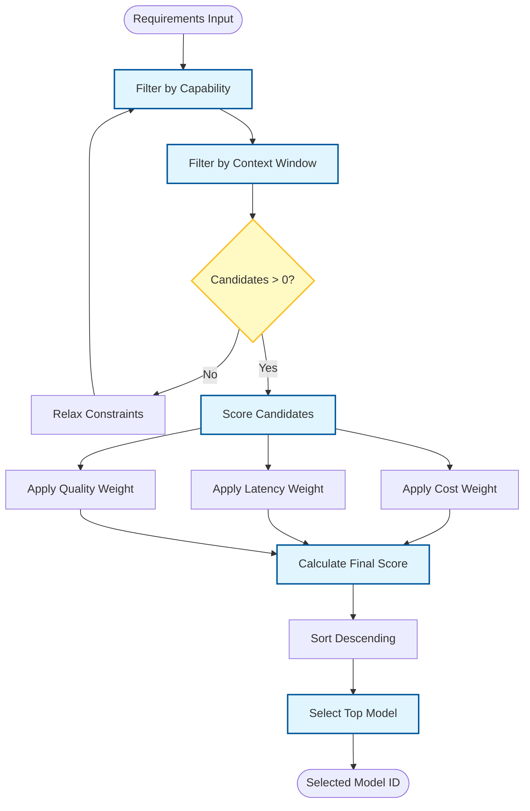

# Model Selection Logic

```mermaid
flowchart TD
    %% Classes
    classDef core fill:#e1f5fe,stroke:#01579b,stroke-width:2px;
    classDef decision fill:#fff9c4,stroke:#fbc02d,stroke-width:2px;
    
    Start([Requirements Input]) --> Filter1[Filter by Capability]:::core
    Filter1 --> Filter2[Filter by Context Window]:::core
    
    Filter2 --> Candidates{Candidates > 0?}:::decision
    
    Candidates -- No --> Fallback[Relax Constraints]:::process
    Fallback --> Filter1
    
    Candidates -- Yes --> Score[Score Candidates]:::core
    
    Score --> CostWeight[Apply Cost Weight]:::process
    Score --> LatencyWeight[Apply Latency Weight]:::process
    Score --> QualityWeight[Apply Quality Weight]:::process
    
    CostWeight & LatencyWeight & QualityWeight --> Aggregate[Calculate Final Score]:::core
    
    Aggregate --> Sort[Sort Descending]:::process
    Sort --> Pick[Select Top Model]:::core
    
    Pick --> End([Selected Model ID])
```
