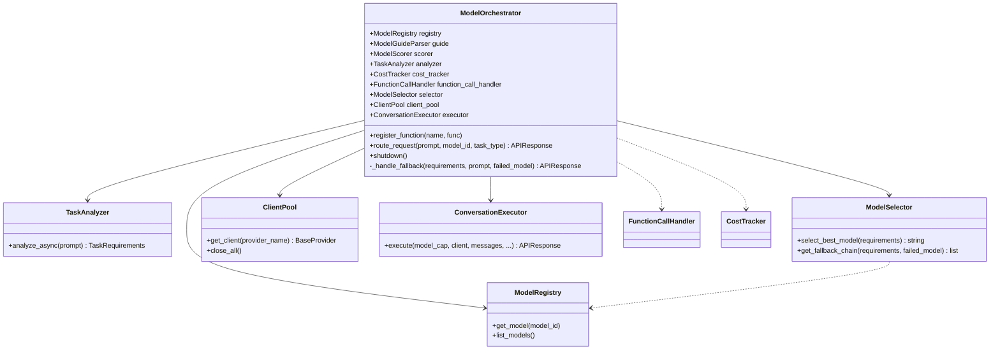

# Class Diagram

```mermaid
classDiagram
    %% Standard Class Definitions (Note: classDiagram uses specific syntax, attempting compatible one or omitting if strict)
    %% For classDiagram, we use `class ClassName className` at the end or proper `style` if definitions don't work inline.
    %% Newer mermaid supports classDef in classDiagram.
    classDef core fill:#e1f5fe,stroke:#01579b,stroke-width:2px;
    classDef agent fill:#e0f2f1,stroke:#004d40,stroke-width:2px;
    classDef cli fill:#fff3e0,stroke:#e65100,stroke-width:2px;
    classDef external fill:#f5f5f5,stroke:#616161,stroke-width:2px,stroke-dasharray: 5 5;
    classDef error fill:#ffebee,stroke:#b71c1c,stroke-width:2px;

    class ModelOrchestrator :::core
    class ModelRegistry :::core
    class TaskAnalyzer :::core
    class ModelSelector :::core
    class ClientPool :::core
    class ConversationExecutor :::core

    class ModelOrchestrator {
        +ModelRegistry registry
        +ModelGuideParser guide
        +ModelScorer scorer
        +TaskAnalyzer analyzer
        +CostTracker cost_tracker
        +FunctionCallHandler function_call_handler
        +ModelSelector selector
        +ClientPool client_pool
        +ConversationExecutor executor
        +register_function(name, func)
        +route_request(prompt, model_id, task_type) APIResponse
        +shutdown()
        -_handle_fallback(requirements, prompt, failed_model) APIResponse
    }

    class ModelRegistry {
        +get_model(model_id)
        +list_models()
    }

    class TaskAnalyzer {
        +analyze_async(prompt) TaskRequirements
    }

    class ModelSelector {
        +select_best_model(requirements) string
        +get_fallback_chain(requirements, failed_model) list
    }

    class ClientPool {
        +get_client(provider_name) BaseProvider
        +close_all()
    }

    class ConversationExecutor {
        +execute(model_cap, client, messages, ...) APIResponse
    }

    ModelOrchestrator --> ModelRegistry
    ModelOrchestrator --> TaskAnalyzer
    ModelOrchestrator --> ModelSelector
    ModelOrchestrator --> ClientPool
    ModelOrchestrator --> ConversationExecutor
    ModelSelector ..> ModelRegistry
    ModelOrchestrator ..> FunctionCallHandler
    ModelOrchestrator ..> CostTracker
```
