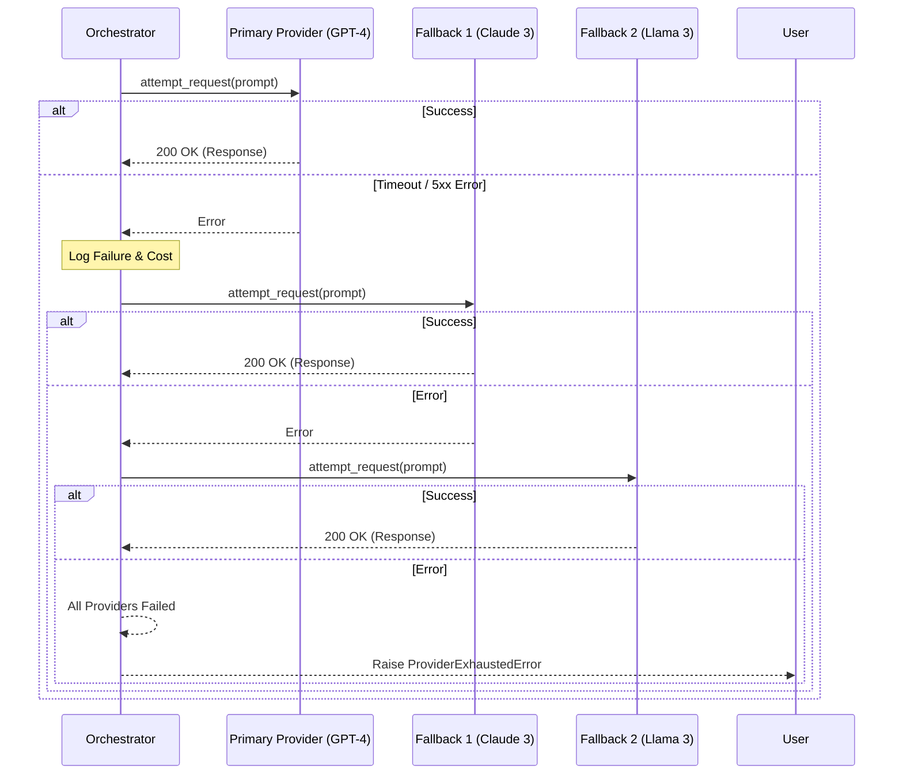

# Provider Fallback Strategy

```mermaid
sequenceDiagram
    participant Orch as Orchestrator
    participant P1 as Primary Provider (GPT-4)
    participant P2 as Fallback 1 (Claude 3)
    participant P3 as Fallback 2 (Llama 3)

    Orch->>P1: attempt_request(prompt)

    alt Success
        P1-->>Orch: 200 OK (Response)
    else Timeout / 5xx Error
        P1-->>Orch: Error
        Note over Orch: Log Failure & Cost

        Orch->>P2: attempt_request(prompt)

        alt Success
            P2-->>Orch: 200 OK (Response)
        else Error
            P2-->>Orch: Error

            Orch->>P3: attempt_request(prompt)
            alt Success
                P3-->>Orch: 200 OK (Response)
            else Error
                Orch-->>Orch: All Providers Failed
                Orch-->>User: Raise ProviderExhaustedError
            end
        end
    end
```
