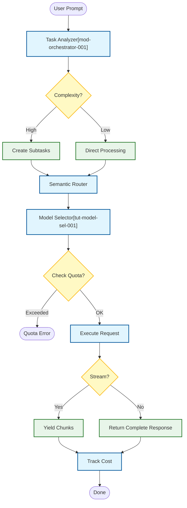

# Request Routing Pipeline

```mermaid
flowchart TD
    %% Classes
    classDef core fill:#e1f5fe,stroke:#01579b,stroke-width:2px;
    classDef process fill:#e8f5e9,stroke:#2e7d32,stroke-width:2px;
    classDef decision fill:#fff9c4,stroke:#fbc02d,stroke-width:2px;

    Input([User Prompt]) --> Analyzer["Task Analyzer[mod-orchestrator-001]"]:::core
    
    Analyzer --> Complexity{Complexity?}:::decision
    
    Complexity -- High --> Planner[Create Subtasks]:::process
    Complexity -- Low --> Direct[Direct Processing]:::process
    
    Planner --> Router["Semantic Router"]:::core
    Direct --> Router
    
    Router --> ModelSelect["Model Selector[tut-model-sel-001]"]:::core
    
    ModelSelect --> CheckQuota{Check Quota?}:::decision
    CheckQuota -- Exceeded --> Error([Quota Error]):::error
    CheckQuota -- OK --> Execute["Execute Request"]:::core
    
    Execute --> Stream{Stream?}:::decision
    Stream -- Yes --> Yield[Yield Chunks]:::process
    Stream -- No --> Return[Return Complete Response]:::process
    
    Yield --> Cost[Track Cost]:::core
    Return --> Cost
    
    Cost --> End([Done])
```
