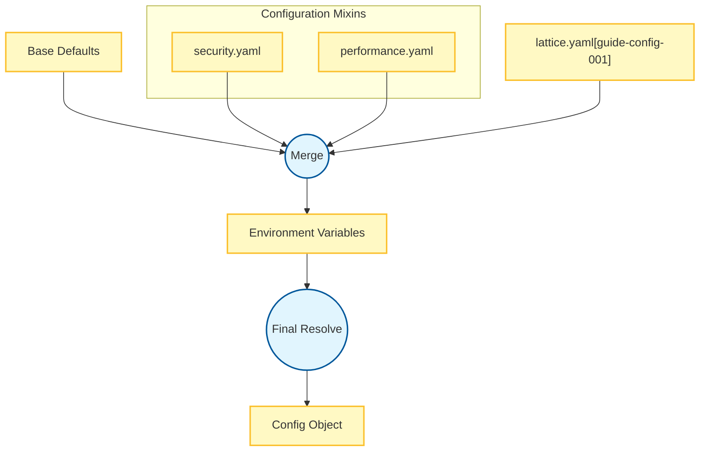

# Configuration Inheritance Flow

```mermaid
graph TD
    %% Standard Class Definitions
    classDef config fill:#fff9c4,stroke:#fbc02d,stroke-width:2px;
    classDef process fill:#e1f5fe,stroke:#01579b,stroke-width:2px;
    
    BaseDefaults[Base Defaults]:::config --> Merger((Merge)):::process
    
    subgraph Mixins [Configuration Mixins]
        Security[security.yaml]:::config
        Performance[performance.yaml]:::config
    end
    
    Security --> Merger
    Performance --> Merger
    
    LocalConfig["lattice.yaml[guide-config-001]"]:::config --> Merger
    
    Merger --> EnvVars[Environment Variables]:::config
    EnvVars --> FinalResolver((Final Resolve)):::process
    
    FinalResolver --> ConfigObj[Config Object]:::config
```
