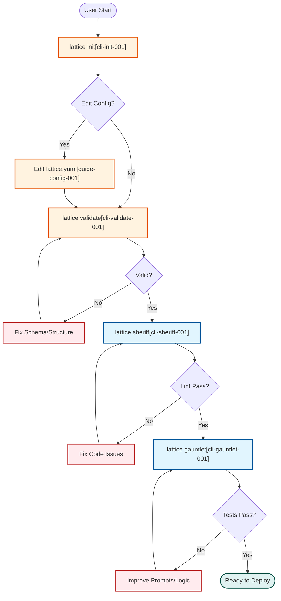

# User Flow

```mermaid
flowchart TD
    %% Standard Class Definitions
    classDef core fill:#e1f5fe,stroke:#01579b,stroke-width:2px;
    classDef agent fill:#e0f2f1,stroke:#004d40,stroke-width:2px;
    classDef cli fill:#fff3e0,stroke:#e65100,stroke-width:2px;
    classDef external fill:#f5f5f5,stroke:#616161,stroke-width:2px,stroke-dasharray: 5 5;
    classDef error fill:#ffebee,stroke:#b71c1c,stroke-width:2px;

    Start([User Start]) --> Init["lattice init[cli-init-001]"]:::cli
    Init --> Config{Edit Config?}
    Config -- Yes --> Edit["Edit lattice.yaml[guide-config-001]"]:::cli
    Config -- No --> Validate["lattice validate[cli-validate-001]"]:::cli
    
    Edit --> Validate
    
    Validate --> Valid{Valid?}
    Valid -- No --> Fix[Fix Schema/Structure]:::error
    Fix --> Validate
    
    Valid -- Yes --> Sheriff["lattice sheriff[cli-sheriff-001]"]:::core
    Sheriff --> Lint{Lint Pass?}
    Lint -- No --> FixCode[Fix Code Issues]:::error
    FixCode --> Sheriff
    
    Lint -- Yes --> Gauntlet["lattice gauntlet[cli-gauntlet-001]"]:::core
    Gauntlet --> Tests{Tests Pass?}
    Tests -- No --> Improve[Improve Prompts/Logic]:::error
    Improve --> Gauntlet
    
    Tests -- Yes --> Deploy([Ready to Deploy]):::agent
```
