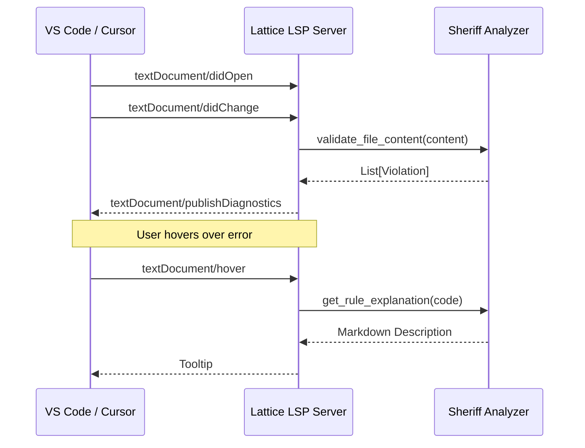

# IDE Integration Flow

```mermaid
sequenceDiagram
    participant Editor as VS Code / Cursor
    participant LSP as Lattice LSP Server
    participant Sheriff as Sheriff Analyzer

    Editor->>LSP: textDocument/didOpen
    Editor->>LSP: textDocument/didChange

    LSP->>Sheriff: validate_file_content(content)
    Sheriff-->>LSP: List[Violation]

    LSP-->>Editor: textDocument/publishDiagnostics

    Note over Editor, LSP: User hovers over error

    Editor->>LSP: textDocument/hover
    LSP->>Sheriff: get_rule_explanation(code)
    Sheriff-->>LSP: Markdown Description
    LSP-->>Editor: Tooltip
```
