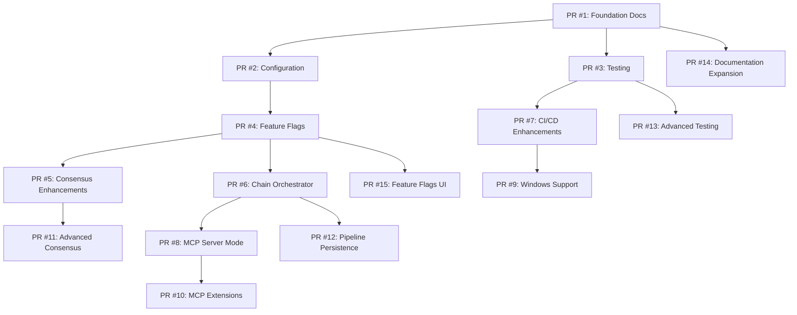

# PAL MCP Gap Remediation Implementation Plan

> **Based on:** [PAL MCP Analysis](00_executive_summary.md)  
> **Created:** 2026-01-01  
> **Status:** In Progress

---

## Overview

This plan organizes all recommendations from the PAL MCP comparative analysis into logical PRs. All work is sequenced by priority and dependency - earlier PRs must be completed before later ones where noted. **No work is deferred - all items are executed in order until complete.**

### Priority Legend
- **P0**: Critical - Do immediately
- **P1**: High - Complete after P0
- **P2**: Medium - Complete after P1
- **P3**: Low - Complete after P2

---

## PR Dependency Graph

---

## PR #1: Foundation Documentation (P0)

> **Priority**: P0 - Critical  
> **Dependencies**: None

### Tasks

- [ ] **1.1 Create `CLAUDE.md`** at repository root
  - [ ] Add quick commands section (make lint, test, ci)
  - [ ] Add project structure overview
  - [ ] Add code style summary from contributing.md
  - [ ] Add testing instructions
  - [ ] Add key patterns section

- [ ] **1.2 Create `.env.example`** at repository root
  - [ ] Add provider API keys section (OpenAI, Anthropic, Google, xAI)
  - [ ] Add AWS Bedrock section
  - [ ] Add Ollama/local models section
  - [ ] Add feature flags placeholder
  - [ ] Add logging configuration
  - [ ] Add database configuration
  - [ ] Add admin API secrets section

- [ ] **1.3 Create `SECURITY.md`** at repository root
  - [ ] Add supported versions table
  - [ ] Add vulnerability reporting process
  - [ ] Add security contact information
  - [ ] Add responsible disclosure policy

- [ ] **1.4 Create `CHANGELOG.md`** at repository root
  - [ ] Initialize with current version (2.1.0)
  - [ ] Add sections: Added, Changed, Fixed, Removed
  - [ ] Backfill recent notable changes

- [ ] **1.5 Expand `README.md`**
  - [ ] Add feature overview with badges (build, coverage, version)
  - [ ] Add quick start code example
  - [ ] Add architecture diagram (mermaid)
  - [ ] Add installation instructions
  - [ ] Add link to documentation

---

## PR #2: Configuration Infrastructure (P0)

> **Priority**: P0 - Critical  
> **Dependencies**: None (can run parallel with PR #1)

### Tasks

- [ ] **2.1 Add models config path override**
  - [ ] Add `LATTICE_MODELS_CONFIG_PATH` env var support
  - [ ] Update `ModelRegistry` to check for override path
  - [ ] Add fallback to embedded `models.yaml`
  - [ ] Document in `.env.example`

- [ ] **2.2 Add default model selection override**
  - [ ] Add `LATTICE_DEFAULT_MODEL` env var support
  - [ ] Update `ModelOrchestrator` to respect override
  - [ ] Support `auto` value for dynamic selection
  - [ ] Document in `.env.example`

- [ ] **2.3 Add logging configuration**
  - [ ] Add `LATTICE_LOG_LEVEL` env var support
  - [ ] Update logging configuration to use env var
  - [ ] Default to `INFO` level
  - [ ] Document in `.env.example`

- [ ] **2.4 Add scorer config path override**
  - [ ] Add `LATTICE_SCORER_CONFIG_PATH` env var support
  - [ ] Update scorer to check for override path
  - [ ] Document in `.env.example`

- [ ] **2.5 Add force override flag**
  - [ ] Add `LATTICE_FORCE_ENV_OVERRIDE` env var
  - [ ] Implement force override logic for testing
  - [ ] Document usage and caveats

---

## PR #3: Testing Infrastructure Enhancements (P1)

> **Priority**: P1 - High  
> **Dependencies**: None

### Tasks

- [ ] **3.1 Add critical test marker**
  - [ ] Define `@pytest.mark.critical` marker in `pyproject.toml`
  - [ ] Add marker to registry tests (`test_registry_loads_models`)
  - [ ] Add marker to orchestrator core tests
  - [ ] Add marker to Sheriff validation tests
  - [ ] Add marker to CLI command tests (basic functionality)
  - [ ] Document marker usage in contributing.md

- [ ] **3.2 Add quick test mode**
  - [ ] Add `test-quick` target to Makefile
  - [ ] Configure to run only `@pytest.mark.critical` tests
  - [ ] Disable coverage for quick mode
  - [ ] Use `--tb=short` for compact output
  - [ ] Document in CLAUDE.md and contributing.md

- [ ] **3.3 Add cross-module marker**
  - [ ] Define `@pytest.mark.cross_module` marker in `pyproject.toml`
  - [ ] Create initial cross-module test (orchestrator → sheriff flow)
  - [ ] Document marker usage

- [ ] **3.4 Add cassette/recording pattern for API tests**
  - [ ] Add `responses` library to dev dependencies
  - [ ] Create cassette fixtures for OpenAI API
  - [ ] Create cassette fixtures for Anthropic API
  - [ ] Create cassette fixtures for Google API
  - [ ] Document cassette usage

---

## PR #4: Feature Flags System (P1)

> **Priority**: P1 - High  
> **Dependencies**: PR #1 (for .env.example updates)

### Tasks

- [ ] **4.1 Implement feature flags infrastructure**
  - [ ] Create `src/lattice_lock/config/feature_flags.py`
  - [ ] Add `LATTICE_DISABLED_FEATURES` env var parsing
  - [ ] Implement `is_feature_enabled(feature: str) -> bool`
  - [ ] Define feature constants (sheriff, gauntlet, feedback, rollback, consensus, mcp)
  - [ ] Add logging for disabled features

- [ ] **4.2 Integrate with Sheriff**
  - [ ] Add feature check in `run_sheriff()` entry point
  - [ ] Return early with message if disabled
  - [ ] Update CLI to show disabled state

- [ ] **4.3 Integrate with Gauntlet**
  - [ ] Add feature check in `GauntletGenerator` entry point
  - [ ] Return early with message if disabled
  - [ ] Update CLI to show disabled state

- [ ] **4.4 Integrate with optional features**
  - [ ] Add feature check for `feedback` module
  - [ ] Add feature check for `rollback` module
  - [ ] Add feature check for `consensus` module
  - [ ] Document all available feature flags

- [ ] **4.5 Update configuration documentation**
  - [ ] Update `.env.example` with feature flags section
  - [ ] Update `CLAUDE.md` with feature flags info
  - [ ] Add troubleshooting guide for disabled features

- [ ] **4.6 Add feature flag presets**
  - [ ] Create `minimal` preset (core orchestrator only)
  - [ ] Create `standard` preset (orchestrator + sheriff + gauntlet)
  - [ ] Create `full` preset (all features enabled)
  - [ ] Add `LATTICE_FEATURE_PRESET` env var

---

## PR #5: Consensus Engine Enhancements (P1)

> **Priority**: P1 - High  
> **Dependencies**: PR #4 (feature flags)

### Tasks

- [ ] **5.1 Add named confidence levels**
  - [ ] Create `ConfidenceLevel` enum in consensus module
    - [ ] `exploring` (0.0 - 0.2)
    - [ ] `low` (0.2 - 0.4)
    - [ ] `medium` (0.4 - 0.6)
    - [ ] `high` (0.6 - 0.8)
    - [ ] `very_high` (0.8 - 0.9)
    - [ ] `almost_certain` (0.9 - 0.95)
    - [ ] `certain` (0.95 - 1.0)
  - [ ] Add `get_confidence_level(score: float) -> ConfidenceLevel`
  - [ ] Update `ConsensusEngine` output to include level
  - [ ] Update `ConsensusOrchestrator` output to include level

- [ ] **5.2 Add confidence levels to Sheriff**
  - [ ] Add confidence level to violation output
  - [ ] Add confidence level to overall analysis result
  - [ ] Update Sheriff formatters for new field

- [ ] **5.3 Add stance steering to ConsensusEngine**
  - [ ] Add `stance_steering` parameter to `execute_voting()`
  - [ ] Define stance options: `advocate_for`, `advocate_against`, `neutral_arbiter`
  - [ ] Modify prompt generation to include stance
  - [ ] Update result synthesis to note stances
  - [ ] Add tests for stance steering functionality

- [ ] **5.4 Add stance steering presets**
  - [ ] Create `debate` preset: advocate_for vs advocate_against vs neutral
  - [ ] Create `review` preset: critic vs supporter vs balanced
  - [ ] Create `analysis` preset: optimist vs pessimist vs realist
  - [ ] Add preset selection to CLI

- [ ] **5.5 Update CLI and documentation**
  - [ ] Add `--stance` option to consensus CLI
  - [ ] Add `--preset` option to consensus CLI
  - [ ] Document stance steering usage with examples
  - [ ] Add examples in docs/guides/

---

## PR #6: Chain Orchestrator Enhancements (P1)

> **Priority**: P1 - High  
> **Dependencies**: PR #4 (feature flags)

### Tasks

- [ ] **6.1 Add step tracking to pipeline results**
  - [ ] Add `step_number` to each step result
  - [ ] Add `total_steps` to pipeline result
  - [ ] Add `current_step_name` to pipeline result
  - [ ] Add `completed_steps` list to pipeline result
  - [ ] Update `PipelineResult` dataclass

- [ ] **6.2 Add progress callback support**
  - [ ] Add `on_step_complete` callback parameter
  - [ ] Add `on_step_start` callback parameter
  - [ ] Pass step info to callbacks
  - [ ] Support async callbacks

- [ ] **6.3 Add enhanced logging**
  - [ ] Log step start with step number
  - [ ] Log step completion with duration
  - [ ] Log pipeline summary on completion
  - [ ] Add structured logging format option

- [ ] **6.4 Update CLI output**
  - [ ] Update `lattice chain` to show step progress
  - [ ] Add progress bar option (--progress)
  - [ ] Show elapsed time per step

- [ ] **6.5 Add max steps limit**
  - [ ] Add `max_pipeline_steps` configuration
  - [ ] Add `LATTICE_MAX_PIPELINE_STEPS` env var
  - [ ] Implement step limit enforcement
  - [ ] Add clear error message when limit reached

---

## PR #7: CI/CD Enhancements (P2)

> **Priority**: P2 - Medium  
> **Dependencies**: PR #1 (CHANGELOG.md creation)

### Tasks

- [ ] **7.1 Add changelog automation**
  - [ ] Install `conventional-changelog-action` in release workflow
  - [ ] Configure to update CHANGELOG.md on release
  - [ ] Use conventional commits format
  - [ ] Auto-commit changelog updates

- [ ] **7.2 Add version sync automation**
  - [ ] Add version sync step to release workflow
  - [ ] Sync tag version to `src/lattice_lock/__init__.py`
  - [ ] Use `[skip ci]` commit message to prevent loop
  - [ ] Add version check to CI

- [ ] **7.3 Add Docker CI workflow**
  - [ ] Create `.github/workflows/docker.yml`
  - [ ] Build on push to main and tags
  - [ ] Push to ghcr.io on tag
  - [ ] Tag with version and `latest`
  - [ ] Add build cache for faster CI

- [ ] **7.4 Add container security scanning**
  - [ ] Add Trivy scanner to Docker workflow
  - [ ] Fail on critical vulnerabilities
  - [ ] Generate security report

- [ ] **7.5 Add multi-platform Docker builds**
  - [ ] Add linux/amd64 platform
  - [ ] Add linux/arm64 platform
  - [ ] Use buildx for multi-platform

- [ ] **7.6 Document reusable workflows**
  - [ ] Create `.github/workflows/USAGE.md`
  - [ ] Document all input parameters
  - [ ] Add usage examples for external repos
  - [ ] Document output variables

---

## PR #8: MCP Server Mode (P2)

> **Priority**: P2 - Medium  
> **Dependencies**: PR #4 (feature flags), PR #5 (consensus enhancements)

### Tasks

- [ ] **8.1 Add MCP SDK integration**
  - [ ] Add `mcp` package to dependencies
  - [ ] Create `src/lattice_lock/mcp/` module structure
  - [ ] Implement base MCP server class
  - [ ] Add server configuration

- [ ] **8.2 Expose Sheriff as MCP tool**
  - [ ] Create `lattice_validate` MCP tool
  - [ ] Accept path and config parameters
  - [ ] Return violations with confidence levels
  - [ ] Support file and directory validation

- [ ] **8.3 Expose Gauntlet as MCP tool**
  - [ ] Create `lattice_test` MCP tool
  - [ ] Accept lattice config path parameter
  - [ ] Return test results
  - [ ] Support selective test execution

- [ ] **8.4 Expose Orchestrator as MCP tool**
  - [ ] Create `lattice_ask` MCP tool
  - [ ] Accept prompt and model parameters
  - [ ] Support streaming responses
  - [ ] Return usage metrics

- [ ] **8.5 Add MCP server startup**
  - [ ] Create `lattice mcp` CLI command
  - [ ] Support stdio and SSE transport
  - [ ] Add server configuration file
  - [ ] Document MCP server setup

- [ ] **8.6 Add MCP resource exposure**
  - [ ] Expose `lattice.yaml` as MCP resource
  - [ ] Expose `models.yaml` as MCP resource
  - [ ] Add resource read/write permissions

---

## PR #9: Windows Support (P2)

> **Priority**: P2 - Medium  
> **Dependencies**: PR #7 (CI/CD)

### Tasks

- [ ] **9.1 Create PowerShell CI scripts**
  - [ ] Create `scripts/run-ci.ps1`
  - [ ] Create `scripts/run-tests.ps1`
  - [ ] Create `scripts/setup-env.ps1`
  - [ ] Create `scripts/install-deps.ps1`

- [ ] **9.2 Add Windows CI job**
  - [ ] Add Windows runner to CI matrix
  - [ ] Use PowerShell scripts on Windows
  - [ ] Test on Windows Server 2022

- [ ] **9.3 Update documentation**
  - [ ] Add Windows setup instructions to README
  - [ ] Add Windows-specific troubleshooting
  - [ ] Update CLAUDE.md with Windows commands

---

## PR #10: MCP Extensions (P2)

> **Priority**: P2 - Medium  
> **Dependencies**: PR #8 (MCP Server Mode)

### Tasks

- [ ] **10.1 Add MCP prompt templates**
  - [ ] Create governance prompt template
  - [ ] Create code review prompt template
  - [ ] Create test generation prompt template
  - [ ] Expose templates via MCP

- [ ] **10.2 Add conversation context support**
  - [ ] Store conversation history in MCP session
  - [ ] Support multi-turn conversations
  - [ ] Add context window management

- [ ] **10.3 Add multi-project MCP configuration**
  - [ ] Support per-project lattice.yaml discovery
  - [ ] Support per-repo configuration
  - [ ] Add project switching command

- [ ] **10.4 Create IDE integration guides**
  - [ ] Write Claude Code integration guide
  - [ ] Write Cursor integration guide
  - [ ] Write VS Code MCP extension guide
  - [ ] Add troubleshooting for each IDE

- [ ] **10.5 Add MCP permission management**
  - [ ] Define permission levels (read, write, execute)
  - [ ] Add per-project permissions
  - [ ] Add per-repo permissions
  - [ ] Add permission configuration file

---

## PR #11: Advanced Consensus (P3)

> **Priority**: P3 - Low  
> **Dependencies**: PR #5 (Consensus Enhancements)

### Tasks

- [ ] **11.1 Add multi-round debate mode**
  - [ ] Implement round-based debate execution
  - [ ] Allow models to respond to each other
  - [ ] Add configurable round count
  - [ ] Synthesize final result from all rounds

- [ ] **11.2 Add stance strength parameter**
  - [ ] Define strength levels: mild, moderate, strong
  - [ ] Adjust prompts based on strength
  - [ ] Document stance strength usage

- [ ] **11.3 Add cross-model stance compatibility matrix**
  - [ ] Research model personality differences
  - [ ] Create compatibility recommendations
  - [ ] Document model pairing suggestions

- [ ] **11.4 Add consensus visualization**
  - [ ] Create admin dashboard consensus view
  - [ ] Show voting breakdown
  - [ ] Show stance influence
  - [ ] Add historical debate analysis

---

## PR #12: Pipeline Persistence (P3)

> **Priority**: P3 - Low  
> **Dependencies**: PR #6 (Chain Orchestrator Enhancements)

### Tasks

- [ ] **12.1 Add `continuation_id` for multi-step recovery**
  - [ ] Generate unique ID per pipeline run
  - [ ] Persist pipeline state to database
  - [ ] Support resume from failed step
  - [ ] Add timeout configuration (`pipeline_timeout_hours`)

- [ ] **12.2 Add cross-session pipeline continuation**
  - [ ] Store pipeline state with session ID
  - [ ] Add `lattice chain resume` command
  - [ ] Show pending pipelines list

- [ ] **12.3 Add pipeline history and replay**
  - [ ] Store completed pipeline runs
  - [ ] Add `lattice chain history` command
  - [ ] Add `lattice chain replay` command

- [ ] **12.4 Add pipeline visualization**
  - [ ] Create admin dashboard pipeline view
  - [ ] Show step progress
  - [ ] Show historical runs
  - [ ] Add Gantt chart for timing

- [ ] **12.5 Add parallel step execution support**
  - [ ] Detect parallelizable steps
  - [ ] Execute independent steps concurrently
  - [ ] Merge parallel results correctly

---

## PR #13: Advanced Testing (P3)

> **Priority**: P3 - Low  
> **Dependencies**: PR #3 (Testing Infrastructure)

### Tasks

- [ ] **13.1 Add simulator test pattern**
  - [ ] Create communication simulator framework
  - [ ] Test complex multi-model workflows
  - [ ] Validate continuation threading

- [ ] **13.2 Add full governance flow test**
  - [ ] Test compile → validate → test → report flow
  - [ ] Validate end-to-end behavior
  - [ ] Add regression tests

- [ ] **13.3 Add performance benchmarks**
  - [ ] Add pytest-benchmark to dev dependencies
  - [ ] Benchmark model selection
  - [ ] Benchmark Sheriff analysis
  - [ ] Add benchmark CI job

- [ ] **13.4 Add mutation testing**
  - [ ] Add mutmut to dev dependencies
  - [ ] Configure mutation testing
  - [ ] Set mutation score target

- [ ] **13.5 Add property-based testing**
  - [ ] Add hypothesis to dev dependencies
  - [ ] Create property tests for validators
  - [ ] Create property tests for parsers

---

## PR #14: Documentation Expansion (P3)

> **Priority**: P3 - Low  
> **Dependencies**: PR #1 (Foundation Documentation)

### Tasks

- [ ] **14.1 Create `AGENTS.md`**
  - [ ] Document multi-agent coordination context
  - [ ] List agent roles and capabilities
  - [ ] Describe handoff protocols

- [ ] **14.2 Create per-module documentation**
  - [ ] Create `docs/modules/orchestrator.md` - how orchestrator works
  - [ ] Create `docs/modules/sheriff.md` - static analysis details
  - [ ] Create `docs/modules/gauntlet.md` - runtime testing guide
  - [ ] Create `docs/modules/consensus.md` - consensus engine details
  - [ ] Create `docs/modules/chain.md` - pipeline orchestration

- [ ] **14.3 Create video demos**
  - [ ] Record Sheriff workflow demo
  - [ ] Record Gauntlet workflow demo
  - [ ] Record Orchestrator usage demo
  - [ ] Record Consensus debate demo
  - [ ] Embed in documentation

- [ ] **14.4 Add architecture diagrams**
  - [ ] Create component interaction diagram
  - [ ] Create data flow diagram
  - [ ] Create deployment architecture diagram

---

## PR #15: Feature Flags UI (P3)

> **Priority**: P3 - Low  
> **Dependencies**: PR #4 (Feature Flags System)

### Tasks

- [ ] **15.1 Add feature flag admin UI**
  - [ ] Create feature flags page in admin dashboard
  - [ ] Show current state of all flags
  - [ ] Allow toggling flags via UI

- [ ] **15.2 Add per-project feature overrides**
  - [ ] Support feature flags in lattice.yaml
  - [ ] Override env vars with project config
  - [ ] Document project-level configuration

- [ ] **15.3 Add feature flag API endpoint**
  - [ ] Create GET /api/features endpoint
  - [ ] Create PUT /api/features/{name} endpoint
  - [ ] Add authentication

- [ ] **15.4 Add feature usage metrics**
  - [ ] Track feature usage counts
  - [ ] Store metrics in database
  - [ ] Display in admin dashboard

- [ ] **15.5 Add gradual rollout support**
  - [ ] Implement percentage-based enablement
  - [ ] Add user cohort targeting
  - [ ] Add rollout configuration

---

## Summary Tables

### All PRs by Priority

| PR | Priority | Key Deliverables |
|----|----------|------------------|
| #1 Foundation Docs | P0 | CLAUDE.md, .env.example, SECURITY.md, CHANGELOG.md |
| #2 Configuration | P0 | Config overrides, logging, force override |
| #3 Testing | P1 | Critical markers, quick mode, cassettes |
| #4 Feature Flags | P1 | DISABLED_FEATURES, feature presets |
| #5 Consensus | P1 | Confidence levels, stance steering, presets |
| #6 Chain Orchestrator | P1 | Step tracking, callbacks, progress CLI |
| #7 CI/CD | P2 | Changelog, version sync, Docker CI, Trivy |
| #8 MCP Server | P2 | MCP tools for Sheriff/Gauntlet/Orchestrator |
| #9 Windows Support | P2 | PowerShell scripts, Windows CI |
| #10 MCP Extensions | P2 | Templates, context, IDE guides, permissions |
| #11 Advanced Consensus | P3 | Multi-round debate, stance strength |
| #12 Pipeline Persistence | P3 | Continuation ID, history, parallel steps |
| #13 Advanced Testing | P3 | Benchmarks, mutation testing, property tests |
| #14 Documentation | P3 | AGENTS.md, per-module docs, video demos |
| #15 Feature Flags UI | P3 | Admin UI, API, metrics, gradual rollout |

### Execution Order

| Phase | PRs | Focus |
|-------|-----|-------|
| **Phase 1** | #1, #2, #3 | Foundation: Docs, Config, Testing |
| **Phase 2** | #4, #5, #6 | Core Features: Flags, Consensus, Pipelines |
| **Phase 3** | #7, #8, #9 | Infrastructure: CI/CD, MCP, Windows |
| **Phase 4** | #10, #11, #12 | Extensions: MCP+, Consensus+, Pipelines+ |
| **Phase 5** | #13, #14, #15 | Polish: Testing+, Docs+, UI |

---

## Progress Tracking

> Update this section as work progresses

| PR | Status | Assigned | Started | Completed |
|----|--------|----------|---------|-----------|
| #1 Foundation Docs | 🔴 Not Started | - | - | - |
| #2 Configuration | 🔴 Not Started | - | - | - |
| #3 Testing | 🔴 Not Started | - | - | - |
| #4 Feature Flags | 🔴 Not Started | - | - | - |
| #5 Consensus | 🔴 Not Started | - | - | - |
| #6 Chain Orchestrator | 🔴 Not Started | - | - | - |
| #7 CI/CD | 🔴 Not Started | - | - | - |
| #8 MCP Server | 🔴 Not Started | - | - | - |
| #9 Windows Support | 🔴 Not Started | - | - | - |
| #10 MCP Extensions | 🔴 Not Started | - | - | - |
| #11 Advanced Consensus | 🔴 Not Started | - | - | - |
| #12 Pipeline Persistence | 🔴 Not Started | - | - | - |
| #13 Advanced Testing | 🔴 Not Started | - | - | - |
| #14 Documentation | 🔴 Not Started | - | - | - |
| #15 Feature Flags UI | 🔴 Not Started | - | - | - |

**Legend:** 🔴 Not Started | 🟡 In Progress | 🟢 Complete | ⚫ Blocked

---

*Last Updated: 2026-01-01*
